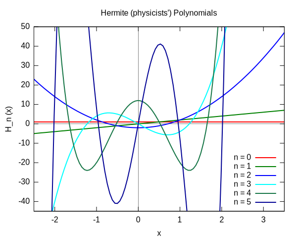

% Orthogonal bases and Fourier analysis
% Nicolás Guarín-Zapata
    email: nguarinz@eafit.edu.co
    github: nicoguaro
% April 16, 2017

------------------

# Inner products

Inner products let us extend geometrical notions such as length of a vector
or angle between vectors for vector spaces that are more abstract than 
$\mathbb{R}^2$ or $\mathbb{R}^3$. It also let us define the orthogonality
between vectors. Inner product spaces generalize the notion of Euclidean
spaces to any dimension.

------------------

# Orthogonal basis

An orthogonal basis for an inner product spaces $V$,   is a basis for $V$
whose vectors are mutually orthogonal. The angle between vectors
($\theta$) is defined using the inner product as

$$\theta = \arccos\left(\frac{\langle x, y\rangle}{\Vert x\Vert\, \Vert y\Vert}\right) \, .$$

If they have magnitude 1, then the base is called _orthonormal_.

------------------

# Examples of (discrete) orthogonal basis: Fourier basis

$$\left\lbrace \frac{1}{\sqrt{\pi}} \sin(nx),
  \frac{1}{\sqrt{\pi}} \cos(nx),
  \frac{1}{\sqrt{2\pi}}\middle|
  \forall n \in \mathbb{N}, \forall x\in [-\pi, \pi]\right\rbrace$$

------------------

# Examples of (discrete) orthogonal basis: Hermite polynomials

$$\left\lbrace (-1)^n e^{x^2}\frac{d^n}{dx^n} e^{-x^2},\middle|
  \forall n \in \mathbb{N}, \forall x\in [-\infty, \infty]\right\rbrace$$
  
with orthogonality as

$$\int\limits_{-\infty}^{\infty} H_m(x) H_n(x) e^{-x^2} dx = \sqrt{\pi}s^n n! \delta_{mn}$$

------------------

# Examples of (discrete) orthogonal basis: Chebyshev polynomials

They are defined by the recursion relation

$$T_0(x) = 1,\, T_1(x) = x,\, T_{n+1} = 2x T_n(x) - T_{n-1}(x),\quad \forall x\in [-1,1]$$
  
with orthogonality as

$$\int\limits_{-1}^{1} T_m(x) T_n(x) \frac{dx}{\sqrt{1 - x^2}} =
  \begin{cases}
    0 &n\neq m \\
    \pi &n=m=0\\
    \pi/2 &n=m\neq 0\end{cases}$$

------------------

# Fourier analysis: definition

From Wikipedia

> In mathematics, Fourier analysis is the study of the way general functions
may be represented or approximated by sums of simpler trigonometric functions.
Fourier analysis grew from the study of Fourier series, and is named after
Joseph Fourier, who showed that representing a function as a sum of
trigonometric functions greatly simplifies the study of heat transfer.

------------------

# Fourier analysis: scientific applications

Fourier analysis has many scientific applications: 

- Signal Processing. It may be the best application of Fourier analysis.

- Approximation Theory. We use Fourier series to write a function as a
trigonometric polynomial.

- Control Theory. The Fourier series of functions in the differential
equation often gives some prediction about the behavior of the solution
of differential equation. They are useful to find out the dynamics of
the solution.

- Partial Differential equation. We use it to solve higher order partial
differential equations by the method of separation of variables.

------------------

# Fourier analysis: applications

Some examples include:

- JPG image compression.

- MP3 sound compression.

- Image processing to remove periodic or anisotropic artifacts such as
jaggies from interlaced video.

- X-ray crystallography to reconstruct a crystal structure from its
diffraction pattern.

------------------

# Fourier series

A Fourier series allow us to represent a (periodic) function as the sum
of sine and cosine functions.

For a function $f(x)$ defined over $[x_0, x_0 + P]$, that is continuous
or piecewise continuous, we write

$$ f(x) = \frac{a_0}{2} + \sum_{n=1}^{\infty}\left[
  a_n \cos\left(\frac{2\pi nx}{P}\right) +
  b_n \sin\left(\frac{2\pi nx}{P}\right) \right]$$

where the coefficients are obtained computing the inner product with the
elements of the base, i.e.

$$a_0 = \frac{2}{P}\int_{x_0}^{x_0+P} f(x)\, dx\\
a_n = \frac{2}{P}\int_{x_0}^{x_0+P} \cos\left(\frac{2\pi nx}{P}\right) f(x)\, dx\\
b_n = \frac{2}{P}\int_{x_0}^{x_0+P} \sin\left(\frac{2\pi nx}{P}\right) f(x)\, dx$$

------------------

# Fourier series visualisation

<iframe
    width="960" height="720"
    src="./img/Fourier_vis.html"
    frameborder="0"
    allowfullscreen
    class="centObj"></iframe>
 
------------------

# Orthogonal basis: continuum case

A set $\lbrace \phi(k, x)\rbrace$ with $x$ and $k$ defined over $(a, b)$, and
$(c, d)$ are orthogonal with weight $w(x)$ ($w(x)$ real) if:

$$\int\limits_{a}^{b} w(x) \phi^* (k, x) \phi(k', x)\, dx = \delta(k - k')\, ,
  \quad x\in(a, b),\, k\in(c, d)\, .$$
  
------------------

# Orthogonal basis: continuum case

If the basis is complete we can write a function $f(x)$ as

$$f(x) = \int\limits_{a}^{b} C(k) \phi(k', x)\, dx\, ,$$

with 

$$C(x) = \int\limits_{a}^{b} C(x') w(x')\phi(k, x')\, dx'\, .$$

$C(k)$ is known as the tranform of $f(x)$.

------------------

# Examples of (continuous) orthogonal basis: Fourier transform

When we choose the basis functions $\lbrace \frac{e^{ikx}}{\sqrt{2\pi}}\rbrace$,
we can write a function $f(x)$, that is piecewise continuous and does not grow
faster than exponentially, as

$$f(x) = \frac{1}{\sqrt{2\pi}}\int\limits_{-\infty}^{\infty}F(k) e^{ikx}\, dx\, .$$

Using the orthonormality condition

$$\int\limits_{-\infty}^{\infty} e^{i(k -k') x}dx = 2\pi \delta(k - k')\, ,$$

we can write

$$F(k) = \frac{1}{\sqrt{2\pi}}\int\limits_{-\infty}^{\infty}f(x) e^{-ikx}\, dx\, .$$

------------------

# Example of Fourier transform

We can compute the Fourier transform of a Gaussian function

$$f(x) = e^{-\alpha^2 x^2},\quad x\in(-\infty, \infty)$$

Using the definition and proceeding with the integral we get

\begin{align}
  F(k) &= \frac{1}{\sqrt{2\pi}}\int\limits_{-\infty}^{\infty} e^{-\alpha^2(x^2 + ikx/\alpha^2)} dx\\
       &= \frac{e^{-k/4\alpha^2}}{\sqrt{2\pi}}\int\limits_{-\infty}^{\infty} e^{-\alpha^2(x + ikx/2\alpha^2)^2} dx\\
       &= \frac{1}{\sqrt{\pi} \alpha} e^{-k^2/4\alpha^2} \, .
\end{align}

------------------

# Visualization of Fourier Tranform

    
------------------

# Visualization of Fourier Tranform

    
------------------

# References

- Alonso Sepúlveda Soto. Física matemática. Ciencia y Tecnología. Universidad
  de Antioquia, 2009.

- Pierre Guilleminot's. [Fourier series visualisation with d3.js.](https://bl.ocks.org/jinroh/7524988), 2016.

- Wikipedia contributors. ["Fourier analysis."](https://en.wikipedia.org/wiki/Fourier_analysis)
  Wikipedia, The Free Encyclopedia

- Wikipedia contributors. ["Hermite polynomials."](https://en.wikipedia.org/wiki/Hermite_polynomials)
  Wikipedia, The Free Encyclopedia. 

- Wikipedia contributors. ["Fourier series."](https://en.wikipedia.org/wiki/Fourier_series)
  Wikipedia, The Free Encyclopedia.

- Wikipedia contributors. ["Chebyshev polynomials."](https://en.wikipedia.org/wiki/Chebyshev_polynomials)
  Wikipedia, The Free Encyclopedia.
  
- Wikipedia contributors. ["Fourier transform."](https://en.wikipedia.org/wiki/Fourier_transform)
  Wikipedia, The Free Encyclopedia. 