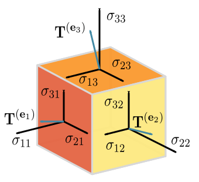
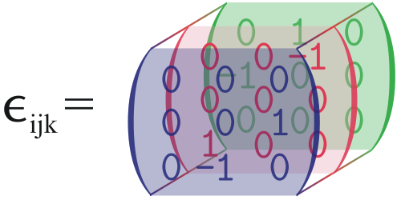
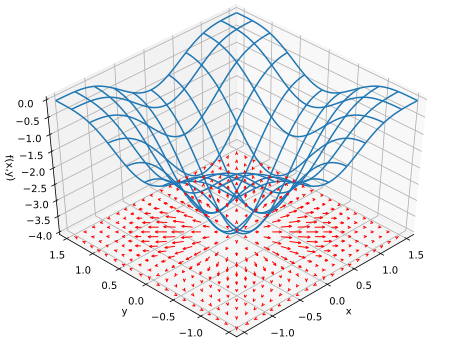

% Curvilinear coordinates and vector calculus
% Nicolás Guarín-Zapata
    email: nguarinz@eafit.edu.co
    github: nicoguaro
% August, 2018

------------------

# Tensors

<table>
<tr>
<td>
Depiction of the Cauchy stress tensor, a second-order tensor.
The tensor's components, in a three-dimensional Cartesian coordinate
system, form the matrix

$$\begin{align}
\sigma & = \begin{bmatrix}\mathbf{T}^{(\mathbf{e}_1)} \mathbf{T}^{(\mathbf{e}_2)} \mathbf{T}^{(\mathbf{e}_3)} \\ \end{bmatrix} \\
& = \begin{bmatrix} \sigma_{11} & \sigma_{12} & \sigma_{13} \\ \sigma_{21} & \sigma_{22} & \sigma_{23} \\ \sigma_{31} & \sigma_{32} & \sigma_{33} \end{bmatrix}\\
\end{align}$$

whose columns are the stresses (forces per unit area) acting on the $\mathbf{e}_1$ , $\mathbf{e}_2$, and $\mathbf{e}_3$ faces of the cube.
</td>
<td>

</td>
</tr>
</table>

------------------

# Kronecker Delta

The Kronecker delta is defined by

$$\delta_{ij} = \begin{cases}
1\quad i=j\\
0\quad i\neq j
\end{cases}$$

and it can be thought as the components of the identity tensor.

------------------

# Levi-Civita symbol

<table>
<tr>
<td>
It is defined by the cross product between element of an orthonormal basis

$$\hat{\mathbf{e}}_i \times \hat{\mathbf{e}}_j = \sum_{k=1}^{3}\epsilon_{ijk} \hat{\mathbf{e}}_k$$

with

$$\begin{align}
\epsilon_{ijk} &= \frac{1}{2} (i - j)(j - k)(k - i)\\
&= \begin{cases}
1\quad \text{even permutation}\\
-1\quad \text{odd permutation}\\
0\quad \text{repeated indices}\\
\end{cases}
\end{align}$$
</td>

<td>

</td>
</tr>
</table>

------------------

# Some operations between second-order Tensors

- $\underline{\underline{T}} \cdot \mathbf{A} = T_{ik} A_k \hat{\mathbf{e}}_i$

- $\underline{\underline{T}} \times \mathbf{A} = \hat{\mathbf{e}}_i \epsilon_{jkl} \hat{\mathbf{e}}_l T_{ik} A_k \neq \mathbf{A} \times \underline{\underline{T}}$

- $\underline{\underline{T}} \cdot \underline{\underline{V}} = T_{ij} V_{kl}\delta_{jk} \hat{\mathbf{e}}_i \hat{\mathbf{e}}_l = T_{ik} V_{kl} \hat{\mathbf{e}}_i \hat{\mathbf{e}}_l$

- $\underline{\underline{T}} : \underline{\underline{V}} = T_{ik} V_{ki}$

------------------

# Curvilinear coordinates example: Cylindrical Coordinates

<iframe
    width="1280" height="720"
    src="./img/polar_coords.html"
    frameborder="0"
    allowfullscreen
    class="centObj"></iframe>

------------------

# Coordinate systems

Two common examples of curvilinear coordinates are

### Cylindrical coordinates

$$\begin{align}
x =& \rho \cos\varphi\\
y =& \rho \sin\varphi\\
z =& z
\end{align}$$

### Spherical coordinates

$$\begin{align}
x =& r \sin\theta \cos\varphi\\
y =& r \sin\theta \sin\varphi\\
z =& r \cos\theta
\end{align}$$

------------------

# Transformations

We can write the position vector as

$$d\mathbf{r} = \sum\limits_{i=1}^3 \frac{\partial \mathbf{r}}{\partial u_i} du_i \, .$$

The factor $\partial \mathbf{r}/\partial u_i$ is a non-unitary vector, we can
introduce a normalized base $\hat{\mathbf{e}}_i$

$$\frac{\partial \mathbf{r}}{\partial u_i} = h_i \hat{\mathbf{e}}_i $$

where

$$\left| \frac{\partial \mathbf{r}}{\partial u_i}\right| = h_i$$

is the [**scale factor**](https://en.wikipedia.org/wiki/Curvilinear_coordinates#Relation_to_Lam.C3.A9_coefficients).

------------------

# Jacobian

We can rewrite the transformation, in components, as

$$d x_i = \sum_j \frac{\partial x_i}{\partial u_j} du_j = \sum_j J_{ij} du_j \, ,$$

where $J_{ij} = \partial x_i/\partial u_j$ are the components of the [Jacobian
matrix](https://en.wikipedia.org/wiki/Jacobian_matrix_and_determinant).

And, its determinant represents the (local) change in volume of the
transformation

$$ |J| = h_1 h_2 h_3\, .$$

------------------

# Line, surface and volume differentials

We can rewrite the transformation as

$$ d\mathbf{r} = \sum_{i=1} h_i \hat{\mathbf{e}}_i du_i = \sum_{i=1}^3 d\mathbf{l}_i \, ,$$

where $d\mathbf{l}_i  = h_i \hat{\mathbf{e}}_i du_i$ is the _line differential_
along the coordinate $u_i$.

We can define the _surface differentials_ as the vectors that are perpendicular
to the differential areas according to the right hand convention, namely

$$d\mathbf{S}_i = d\mathbf{l}_j \times d\mathbf{l}_k =
  h_j h_k \hat{\mathbf{e}}_i du_j du_k = \hat{\mathbf{e}}_i dS_i$$

And the volume differential is given by the volume of the curvilinear
parallelepiped defined by the line differentials, i.e.

$$dV = d\mathbf{l}_1 \cdot (d\mathbf{l}_2 \times \mathbf{l}_3) =
       h_1 h_2 h_3 du_1 du_2 du_3 \, .$$

------------------

# Differential operators

Many physical equations are written as differential equations, and these can be
interpreted as the action of certain operators over some particular functions
knows as fields. There are fields of different nature:

- Scalar fields (temperature, pressure): $\phi = zy^3 - x^2$

- Vector fields (velocity, displacement): $\mathbf{A} = yz^2\hat{\imath} - 2zx^3\hat{\jmath} + xy^2\hat{k}$

- Tensor fields (strain, stresses):

$$\underline{\underline{\sigma}} =
    \begin{pmatrix}
    x^2 &xy &0\\
    xy  &y^2 &0\\
    0 &0 &1
    \end{pmatrix}$$

------------------

## Gradient

The gradient of a scalar function $\phi$, denoted by $\nabla \phi$ is given by

$$\nabla \phi \equiv \sum_{i=1}^3\frac{\hat{\mathbf{e}}_i}{h_i}
    \frac{\partial \phi}{\partial u_i}$$

In spherical coordinates it reads

$$\begin{align}
\nabla \phi &= \frac{\hat{\mathbf{e}}_r}{h_r}\frac{\partial \phi}{\partial r} +
\frac{\hat{\mathbf{e}}_\theta}{h_\theta}\frac{\partial \phi}{\partial \theta} +
\frac{\hat{\mathbf{e}}_\varphi}{h_\varphi}\frac{\partial \phi}{\partial \varphi} \\
    &= \hat{\mathbf{e}}_r \frac{\partial \phi}{\partial r} +
     + \frac{\hat{\mathbf{e}}_\theta}{r}\frac{\partial \phi}{\partial \theta}
     + \frac{\hat{\mathbf{e}}_\varphi}{r\sin\theta}\frac{\partial \phi}{\partial \varphi}
\end{align}$$

------------------

## Gradient: example

The function $f(x,y) = -[\cos^2x + \cos^2y]^2$, has as gradient

$$ \nabla f(x, y) = 4[\cos^2 x + \cos^2 y](\cos x \sin x, \sin x \cos y )$$

------------------

## Divergence

The divergence of a vector function $\mathbf{B}$, denoted by
$\nabla\cdot\mathbf{B}$ or \operatorname{div} \mathbf{B} , is given by

$$\nabla \cdot \mathbf{B} = \operatorname{div} \mathbf{B} = \frac{1}{h}\sum_{i=1}^3
    \frac{\partial}{\partial u_i} \left(\frac{B_i h}{h_i}\right)$$

with $h = h_1 h_2 h_3$.

In spherical coordinates it reads

$$
\nabla \cdot \mathbf{B} = \operatorname{div} \mathbf{B}
    = \frac{1}{r^2}\frac{\partial}{\partial r}(r^2 B_r)
     + \frac{1}{r\sin\theta}\frac{\partial}{\partial \theta}(\sin\theta B_\theta)
     + \frac{1}{r\sin\theta}\frac{\partial}{\partial \varphi}(B_\varphi)
$$

------------------

## Divergence and the Gauss theorem

We can understand the divergence as the flux per unit volume
$\operatorname{div}\mathbf{B} = d\phi/dV$, and we can extend this calculation
to a finite surface

$$\phi = \oint_S \mathbf{B}\cdot d\mathbf{S} = \int_V \operatorname{div}\mathbf{B} dV\, ,$$

The second part is the Gauss theorem

$$\oint_S \mathbf{B}\cdot d\mathbf{S} = \int_V \operatorname{div}\mathbf{B} dV\, .$$

------------------

## Curl

The curl describes the infinitesimal rotation of a (3-dimensional) vector
field. The curl of a field $\mathbf{B}$, denoted by $\operatorname{curl}\mathbf{B}$,
$\operatorname{rot}\mathbf{B}$, or $\nabla\times\mathbf{B}$, is defined by

$$\operatorname{rot} \mathbf{B} = \frac{1}{h}\sum_{i,j,k=1}^1 \hat{\mathbf{e}}_i
  \epsilon_{ijk} h_i \frac{\partial}{\partial u_j} (B_k h_k)\, ,$$

where $h = h_1 h_2 h_3$, and $\epsilon_{ijk}$ is the Levi-Civita symbol.

The Stokes theorem tranform line integrals to surface integrals, and involves
the curl

$$\oint_c \mathbf{B} \cdot d\mathbf{l} = \int_S \operatorname{rot}\mathbf{B}\cdot d\mathbf{S}$$

------------------

## Laplacian

The Laplacian of a scalar function $f(u_i)$, denoted by $\nabla\cdot\nabla f$,
$\nabla^2 f$, or $\Delta f$, it is defined as $\nabla\cdot\nabla f$. It is defined
as

$$\nabla^2 f = \frac{1}{h}\sum_{i=1}^3 \frac{\partial}{\partial u_i}
\left(\frac{h}{h_i^2}\frac{\partial f}{\partial u_i}\right)\, ,$$

with $h = h_1 h_2 h_3$.

For a vector function, the Laplacian is defined like

$$\nabla^2\mathbf{A} = \nabla^2A_x\hat{\imath} + \nabla^2A_y\hat{\jmath} + \nabla^2A_y\hat{k}$$

for Cartesian coordinates, and

$$\nabla^2\mathbf{A} = \nabla(\nabla \cdot \mathbf{A}) - \nabla \times( \nabla \times \mathbf{A})$$

for other coordinate systems.

------------------

# References

- Alonso Sepúlveda Soto. Física matemática. Ciencia y Tecnología. Universidad
  de Antioquia, 2009.

- Wikipedia contributors. ["Tensor."](https://en.wikipedia.org/wiki/Tensor)
  Wikipedia, The Free Encyclopedia. Wikipedia, The Free Encyclopedia,
  Retrieved: 2 Aug. 2017.

- Wikipedia contributors. ["Curvilinear coordinates."](https://en.wikipedia.org/wiki/Curvilinear_coordinates)
  Wikipedia, The Free Encyclopedia. Wikipedia, The Free Encyclopedia, Retrieved: 3 Feb. 2017.

- Wikipedia contributors. ["Gradient."](https://en.wikipedia.org/wiki/Gradient)
Wikipedia, The Free Encyclopedia. Wikipedia, The Free Encyclopedia, Retrieved:
Web. 15 Feb. 2017.

- Wikipedia contributors. ["Divergence."](https://en.wikipedia.org/wiki/Divergence) Wikipedia, The Free Encyclopedia. Wikipedia, The Free Encyclopedia, Retrieved:
Web. 15 Feb. 2017.

- Wikipedia contributors. ["Curl (mathematics)."](https://en.wikipedia.org/wiki/Curl_(mathematics))
Wikipedia, The Free Encyclopedia. Wikipedia, The Free Encyclopedia, Retrieved:
Web. 15 Feb. 2017.

- Wikipedia contributors. ["Laplace operator."](https://en.wikipedia.org/wiki/Laplace_operator) Wikipedia, The Free Encyclopedia. Wikipedia, The Free Encyclopedia, Retrieved: Web. 17 Feb. 2017.
